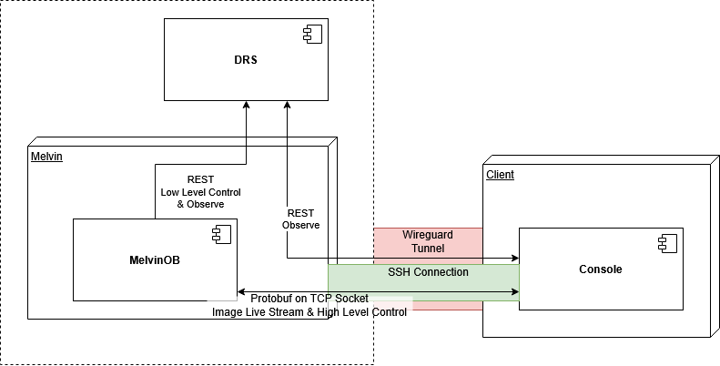

# 🎛️ ciarc_console
Welcome to the onboard software for **Team 03 — "Cache us if you can"** competing in the **2024/2025 ESA Computer in a Room Challenge**.
This repository contains the console application for controlling MELVIN-OB from earth. It can be used for retrieving
telemetry including a live map and for controlling the scheduling of objectives and communication slots.

## 🗟 Code structure
The code is structured in three core packages:
* `model` Contains the internal datamodels, this includes the abstracted model of the melvin api aswell the model of the custom api used for communication with melvin-ob
* `service` Contains the two communication services.
  * The service `groud_station_client` handles communication with the melvin rest api an is used for fetching objectives, achievement.
  * The service `melvin` handles communication with melvin-ob, it provides observability functionality like retrieving a live stream of the imaging process and the current task list aswell as control functionality for marking the zon of secret objectives
* `ui` Holds user interface related components

## 📶 Communication with Melvin-OB
The following shows how the communication between the console and melvin-ob is implemented.
The main design goals were to create a 1. easy-to-use solution that 2. relays on minimal data transfer.
For accomplishing these goals we implemented communication using two different interfaces / data path.

The first data path is used for pulling information about the challenge (objectives, achievements, available communications slots and announcements)
and for booking communications slots. The information exchange is conducted directly via the Melvin REST API tunneled over Wireguard

The second data path is used for interacting directly with melvin-ob and is used for pulling internal state information, the world image and
controlling the scheduling and submission of objectives. It's based on Protobuf Serialisation and direct TCP socket. This rather unusual design choice
was made for a better data rate utilisation in comparison then a REST / Websockets on HTTP approach.



To provide an efficient live stream of the imaging process this second data path is used.
After initial connection of the console melvin-ob sends a thumbnail of the complete world map.
Melvin also keeps sending changed chunks after new images were taken and patched into the internal world image. 
If the console reconnects after a communication pause it requests a differential thumbnail that contains all changed parts
since the last connection.

## 🔨 Building the Project
### ✅ Dependencies
Ensure the following dependencies are installed on your host pc
* Flutter SDK [Install instructions](https://docs.flutter.dev/get-started/install) - Tested with 3.7.0-dev
* Protobuf [Install instructions](https://protobuf.dev/installation/)
  * Dart Plugin [Install instructions](https://github.com/google/protobuf.dart/tree/master/protoc_plugin#how-to-build)

### 🖥️ Build & Execute
```bash
# fetch project dependencies
flutter pub get
# build protobuf model an serializer
cd lib
protoc model/melvin_messages.proto --dart_out=.
cd ..
# build dependency injection
dart pub run build_runner build
# build and run flutter project
flutter run
```